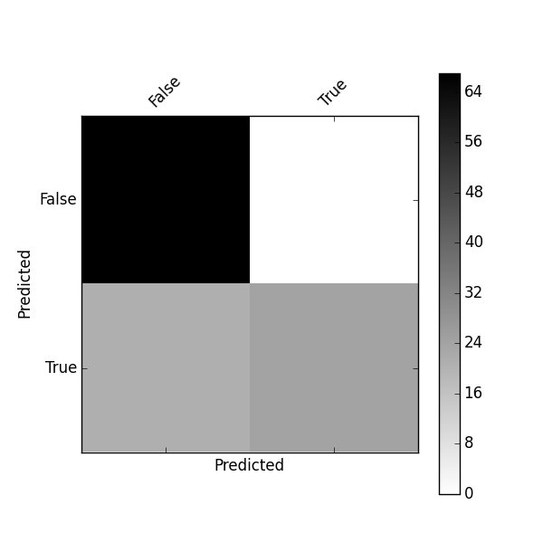
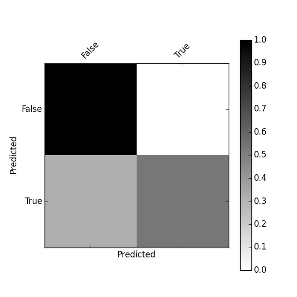

# pandas_confusion

A [Python]() [Pandas](http://pandas.pydata.org/) implementation of [confusion matrix](https://en.wikipedia.org/wiki/Confusion_matrix).

WORK IN PROGRESS - Use it a your own risk

## Usage

    from pandas_confusion import BinaryConfusionMatrix, Backend

    y_actu = pd.Series([ True,  True, False, False, False,  True, False,  True,  True,
               False,  True, False, False, False, False, False,  True, False,
                True,  True,  True,  True, False, False, False,  True, False,
                True, False, False, False, False,  True,  True, False, False,
               False,  True,  True,  True,  True, False, False, False, False,
                True, False, False, False, False, False, False, False, False,
               False,  True,  True, False,  True, False,  True,  True,  True,
               False, False,  True, False,  True, False, False,  True, False,
               False, False, False, False, False, False, False,  True, False,
                True,  True,  True,  True, False, False,  True, False,  True,
                True, False,  True, False,  True, False, False,  True,  True,
               False, False,  True,  True, False, False, False, False, False,
               False,  True,  True, False])

    y_pred = pd.Series([False, False, False, False, False,  True, False, False,  True,
           False,  True, False, False, False, False, False, False, False,
            True,  True,  True,  True, False, False, False, False, False,
           False, False, False, False, False,  True, False, False, False,
           False,  True, False, False, False, False, False, False, False,
            True, False, False, False, False, False, False, False, False,
           False,  True, False, False, False, False, False, False, False,
           False, False,  True, False, False, False, False,  True, False,
           False, False, False, False, False, False, False,  True, False,
           False,  True, False, False, False, False,  True, False,  True,
            True, False, False, False,  True, False, False,  True,  True,
           False, False,  True,  True, False, False, False, False, False,
           False,  True, False, False])

    binary_confusion_matrix = BinaryConfusionMatrix(y_actu, y_pred)
    print("Binary confusion matrix:\n%s" % binary_confusion_matrix)

You can get useful attributes such as True Positive (TP), True Negative (TN) ...

    print binary_confusion_matrix.TP
    

## Matplotlib plot of a binary confusion matrix

    binary_confusion_matrix.plot()
    plt.show()

## Matplotlib plot of a normalized binary confusion matrix

    binary_confusion_matrix.plot(normalized=True)
    plt.show()

## Seaborn plot of a binary confusion matrix (ToDo)

    binary_confusion_matrix.plot(backend=Backend.Seaborn)

## ToDo list

* Convert a confusion matrix to a binary confusion matrix

* Display numbers inside cells like http://stackoverflow.com/questions/5821125/how-to-plot-confusion-matrix-with-string-axis-rather-than-integer-in-python

* Python package

* Unit tests (nose)

* Continuous integration (Travis)

* Code metrics (landscape.io)
